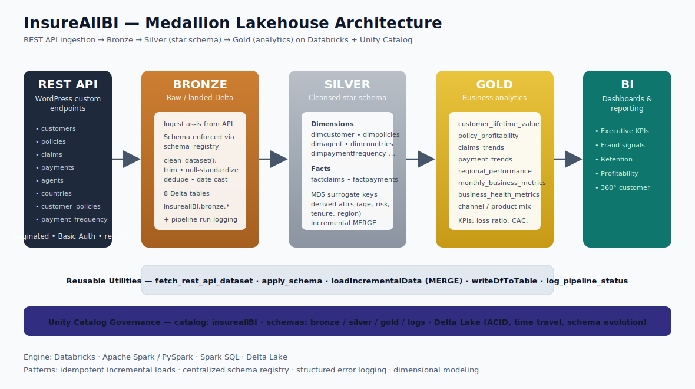

# InsureAllBI — Insurance Analytics Lakehouse

> An end-to-end **Medallion (Bronze → Silver → Gold)** data engineering pipeline on **Databricks**, ingesting insurance data from REST APIs and transforming it into governed, analytics-ready business intelligence.


---

## Overview

**InsureAllBI** is a production-style lakehouse for an insurance business. It pulls eight raw datasets from a paginated REST API, lands them as Delta tables, models them into a dimensional **star schema**, and aggregates them into curated **Gold** tables that answer real business questions — customer lifetime value, policy profitability, claims and fraud trends, regional performance, and overall business health.

The project demonstrates the patterns expected of a modern data engineer: **idempotent incremental loads, a centralized schema registry, reusable utility modules, structured pipeline logging, and Unity Catalog governance**.

## Architecture



Data flows left to right through the medallion layers, with a shared utilities module and Unity Catalog providing cross-cutting reusability and governance.

| Layer | Purpose | Output |
|-------|---------|--------|
| **Bronze** | Raw ingestion from REST API, exactly as received, with schema enforcement and basic cleansing | `insureallBI.bronze.*` (8 Delta tables) |
| **Silver** | Cleansed, conformed **star schema** with surrogate keys and derived business attributes | `insureallBI.silver.dim*` / `fact*` |
| **Gold** | Aggregated, query-ready KPIs and metrics for dashboards | `insureallBI.gold.*` (9 analytics tables) |

## Tech Stack

- **Compute / Engine:** Databricks, Apache Spark (PySpark), Spark SQL
- **Storage:** Delta Lake (ACID, schema evolution, time travel)
- **Governance:** Unity Catalog (`insureallBI` catalog → `bronze` / `silver` / `gold` / `logs` schemas)
- **Ingestion:** REST API integration with pagination, Basic Auth, and rate-limit retry/backoff
- **Modeling:** Kimball-style dimensional modeling (facts + dimensions, hash surrogate keys)

## Repository Structure

```
.
├── README.md
├── LICENSE
├── .gitignore
├── docs/
│   └── architecture.svg
└── RestApiProject/
    ├── misc/
    │   └── Utilities.py          # Reusable pipeline engine (fetch, clean, schema, MERGE, logging)
    ├── bronze/                   # 8 REST → Delta ingestion notebooks
    │   ├── customers.py
    │   ├── policies.py
    │   ├── claims.py
    │   ├── payments.py
    │   ├── agents.py
    │   ├── countries.py
    │   ├── customer_policies.py
    │   └── payment_frequency.py
    ├── silver/                   # Star-schema dimensions & facts
    │   ├── dimcustomer.py
    │   ├── dimpolicies.py
    │   ├── dimagent.py
    │   ├── dimcountries.py
    │   ├── dimcustomerpolicies.py
    │   ├── dimpaymentfrequency.py
    │   ├── factclaims.py
    │   └── factpayments.py
    ├── gold/                     # Curated business analytics
    │   ├── CustomerLifetimeValue.py
    │   ├── PolicyProfitability.py
    │   ├── ClaimsTrends.py
    │   ├── PaymentTrends.py
    │   ├── RegionalPerformance.py
    │   ├── MonthlyBusinessMetrics.py
    │   └── BusinessHealthMetrics.py
    └── InterviewPreparation/
        └── InterviewPreparation.py
```

## Data Sources

Eight datasets are ingested from the REST API:

| Dataset | Description |
|---------|-------------|
| `insurance_customers` | Policyholder master data |
| `insurance_policies` | Policy catalog (premium, coverage, term) |
| `insurance_claims` | Claims with status, settlement, fraud flag |
| `insurance_payments` | Premium payment transactions |
| `insurance_agents` | Sales agent profiles and performance |
| `insurance_countries` | Country reference data |
| `customer_policies` | Customer ↔ policy enrollment bridge |
| `payment_frequency` | Customer payment cadence |

## Pipeline Layers

### Bronze — Ingestion
Each notebook calls the shared `fetch_rest_api_dataset()` utility, which paginates through the API, authenticates, retries on rate limits, applies the registered schema, performs lightweight cleansing, and writes a Delta table. Every run logs success/failure to `insureallBI.logs.pipelineruns` for observability.

### Silver — Dimensional Modeling
Bronze tables are conformed into a **star schema**:
- **Dimensions:** customer, policy, agent, country, customer-policy, payment-frequency
- **Facts:** claims, payments
- **Techniques:** MD5 hash surrogate keys, business-rule derivations (age groups, customer tenure, risk categories, regional mapping, settlement ratios), data-quality flags, and **incremental `MERGE`** loads via `loadIncrementalData()`.

### Gold — Business Analytics
Curated, aggregated tables ready for BI:

| Gold Table | Answers |
|------------|---------|
| `customer_lifetime_value` | Premiums vs. claims, net profitability per customer |
| `policy_profitability` | Which products earn or lose money |
| `claims_trends` | Claim volume, settlement, and fraud over time |
| `payment_trends` | Payment success rates and seasonality |
| `regional_performance` | Geographic performance breakdown |
| `monthly_business_metrics` | MoM / YoY growth |
| `business_health_metrics` | Loss ratio, approval rate, fraud detection rate |

## Key Engineering Features

- **Reusable utility module** — one `Utilities.py` powers all three layers (DRY, consistent, maintainable).
- **Centralized schema registry** — explicit, version-controlled typing for every dataset.
- **Resilient ingestion** — pagination + Basic Auth + exponential rate-limit backoff.
- **Idempotent incremental loads** — dynamic Delta `MERGE` (upsert) generated from the DataFrame schema; first run does a full load, subsequent runs upsert.
- **Surrogate keys** — deterministic MD5 hash keys for stable joins.
- **Observability** — structured pipeline-run logging table.
- **Governance** — Unity Catalog three-level namespace (`catalog.schema.table`).

## Getting Started

> **Prerequisites:** A Databricks workspace with **Unity Catalog** enabled, and permission to create catalogs/schemas.

1. **Create the catalog and schemas**
   ```sql
   CREATE CATALOG IF NOT EXISTS insureallBI;
   CREATE SCHEMA IF NOT EXISTS insureallBI.bronze;
   CREATE SCHEMA IF NOT EXISTS insureallBI.silver;
   CREATE SCHEMA IF NOT EXISTS insureallBI.gold;
   CREATE SCHEMA IF NOT EXISTS insureallBI.logs;
   ```

2. **Import the notebooks** — In Databricks, **Workspace → Import → Folder/Repo** and point it at this repository (or clone via **Repos → Add Repo**).

3. **Configure credentials** — See [Configuration & Security](#configuration--security) below. Do **not** run with credentials hardcoded.

4. **Run order**
   1. `bronze/*` (any order)
   2. `silver/dim*` and `silver/fact*`
   3. `gold/*`

   *(Optionally orchestrate with a Databricks Workflow / Job that chains the three layers.)*

## Configuration & Security

> API credentials are never stored in code. They are read at runtime from Databricks Secrets, keeping them out of source control:

```python
# 1. (One-time, via Databricks CLI) create a secret scope and add secrets
#    databricks secrets create-scope insureallbi
#    databricks secrets put-secret insureallbi api_user
#    databricks secrets put-secret insureallbi api_password

# 2. In Utilities.py, read them at runtime instead of hardcoding:
def fetch_rest_api_dataset(dataset_name, per_page=100, date_columns=None):
    username = dbutils.secrets.get(scope="insureallbi", key="api_user")
    password = dbutils.secrets.get(scope="insureallbi", key="api_password")
    ...
```

This is the industry-standard approach for handling secrets in Databricks pipelines.

## Roadmap / Future Enhancements

- Orchestration with **Databricks Workflows** (or Delta Live Tables) for the full DAG
- **Data quality** assertions with Great Expectations or DLT expectations
- **CI/CD** with Databricks Asset Bundles + GitHub Actions
- SCD Type-2 history on key dimensions
- A published dashboard (Databricks SQL / Power BI) screenshot in `docs/`

## Author

**Sravan Batthula** — Data Engineer
[LinkedIn](https://linkedin.com/in/your-handle) · [Portfolio](https://your-handle.github.io) · [GitHub](https://github.com/your-handle)

## License

Released under the [MIT License](LICENSE).
